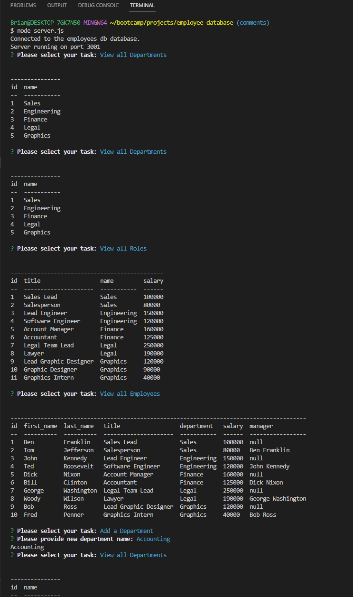

# Employee Database

  

  ## Description

  A node.js database manager to build, edit, and view your company directory.

  ## Contents
  
  - [Usage](#usage)
  - [Installation](#installation)
  - [Contributions](#contributions)
  - [Questions](#questions)

  ## Usage

  Run the application with node.js and follow the navigation to view departments, roles, and employees, add departments, roles, and employees, and update employee      roles. Changes will automatically sync with your database and update it.
  
  For a video of the application in action please click [HERE](https://drive.google.com/file/d/1qSJlC_yisCo4V-Tl1aczlcxJbZcr2jpm/view?usp=share_link)

  ## Installation
  
  Before using Employee Database run npm install from your terminal to install the required dependencies. A .env file is required, follow the setup provided in .env.EXAMPLE included with the application. Before running the application use mySQL to create and set up the database. Optionally you can populate the tables with the seeds provided.

  ## License

  This project is licensed under BSD 3-Clause. For more information (if applicable), please click the following button to learn more:

  

  ## Contributions
  
  Feel free to use in any way that's helpeful to you!

  

  ## Questions
  
  For any questions or comments please reach out to me through github.
  
  https://github.com/Meduion
